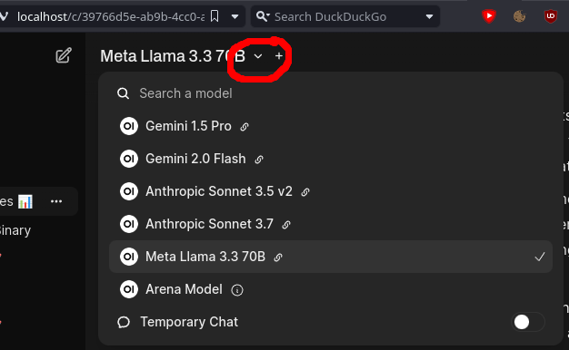

# fma-llm

Quick-install setup for running an llm from an endpoint to use with webui and ghidra-mcp

Based on [this medium piece](https://medium.com/@clearbluejar/supercharging-ghidra-using-local-llms-with-ghidramcp-via-ollama-and-openweb-ui-794cef02ecf7)

## Setup:
0. Make sure `docker`, [`ghidra`](https://github.com/NationalSecurityAgency/ghidra?tab=readme-ov-file#install) and [`uv`](https://docs.astral.sh/uv/) are installed 
1. Add the [GhidraMCP](https://github.com/LaurieWired/GhidraMCP/releases) plugin to Ghidra
    1. Extract the `GhidraMCP-x-y.zip` from the larger .zip
    2. Open Ghidra and go to `File->Install Extensions->➕`
    3. Add the `GhidraMCP-x-y.zip` plugin and restart Ghidra
    4. Open Ghidra's codebrowser window (press the dragon)
        - Ignore the "configure plugin" window that pops up automatically
    5. In codebrowser, go to `File->Configure->Deceloper->Configure`
    6. Make sure the `GhidraMCPPlugin` plugin is checked enabled
2. Download required GhidraMCP files
```bash
wget -O ghidramcp.requirements.txt https://raw.githubusercontent.com/LaurieWired/GhidraMCP/refs/heads/main/requirements.txt
wget -O bridge_mcp_ghidra.py https://raw.githubusercontent.com/LaurieWired/GhidraMCP/refs/heads/main/bridge_mcp_ghidra.py
```
3. Run `setup.sh`
4. Open webui at `http://localhost
    1. Click through "welcome to webui" (if prompted); you should _not_ need a user account
    2. Click the "profile" circle at the top right of the page
    3. Navigate to `Settings>Tools>Manage Tool Servers>➕`
    4. Type `http://localhost:3333` in the (darkenned) `API Base URL` text box
    5. `Save` both the tool setting and your overall Settings
5. Select a model to use with your chat
    1. At the top right of the center element of the page, select the `v` 
    2. Select a model that can make toolcalls (ex `Meta Llama 3.3 70B`)
6. Make sure files are added to your project in ghidra

## Test Chat:
```bash
uv venv
uv pip install -r chat.requirements.txt
uv run chat.py
```